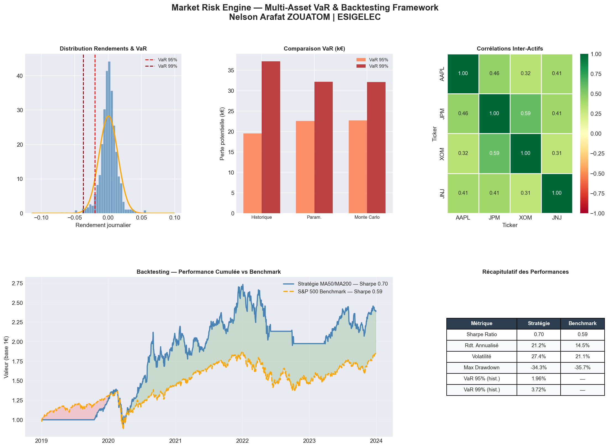

# 📊 Market Risk Engine
### Multi-Asset VaR & Backtesting Framework
*Nelson Arafat ZOUATOM — Étudiant Ingénieur Finance | ESIGELEC*

---

## 🎯 Objectif

Concevoir un outil complet de quantification et de gestion du risque de marché sur un portefeuille multi-actifs, combinant trois méthodes de calcul de la VaR et une stratégie de trading backtestée sur 5 ans de données réelles.

---

# 📊 Market Risk Engine
### Multi-Asset VaR & Backtesting Framework
*Nelson Arafat ZOUATOM — Étudiant Ingénieur Finance | ESIGELEC*

---

## 🎯 Objectif

Concevoir un outil complet de quantification et de gestion du risque de marché sur un portefeuille multi-actifs, combinant trois méthodes de calcul de la VaR et une stratégie de trading backtestée sur 5 ans de données réelles.

---

## 📈 Résultats clés

| Métrique | Résultat |
|---|---|
| **Sharpe Ratio** | 0.70 *(vs 0.59 pour le S&P 500)* |
| **Rendement annualisé** | 21.2% |
| **Maximum Drawdown** | -34.3% |
| **VaR 95% (historique)** | 1.96% |
| **VaR 99% (historique)** | 3.72% |
| **Simulations Monte Carlo** | 10 000 |
| **Période de backtesting** | 2019 – 2024 |

> ✅ La stratégie **surperforme le benchmark S&P 500** sur l'ensemble de la période.

---

## 🛠️ Stack technique
---

Python · NumPy · Pandas · SciPy · Matplotlib · Seaborn · yfinance

---

## 📂 Structure du projet

- `risk_engine.ipynb` — Notebook principal
- `dashboard_final.png` — Dashboard de synthèse
- `var_analysis.png` — Analyse VaR
- `correlation_matrix.png` — Matrice de corrélation
- `backtesting_performance.png` — Performance vs benchmark
- `README.md`

---

## 🔬 Méthodologie

### 1. Portefeuille Multi-Actifs

| Ticker | Société | Secteur |
|---|---|---|
| AAPL | Apple | Technologie |
| JPM | JPMorgan Chase | Finance |
| XOM | ExxonMobil | Énergie |
| JNJ | Johnson & Johnson | Santé |

Données collectées via **Yahoo Finance API** sur 5 ans (2019–2024).

### 2. Value at Risk — 3 méthodes

| Méthode | Principe |
|---|---|
| **Historique** | Distribution empirique des rendements passés |
| **Paramétrique** | Hypothèse de normalité avec μ et σ empiriques |
| **Monte Carlo** | 10 000 simulations de scénarios de marché |

### 3. Backtesting — Trend Following

Stratégie basée sur le croisement de deux moyennes mobiles :

| Signal | Condition |
|---|---|
| **Achat** | MA50 > MA200 (tendance haussière) |
| **Vente** | MA50 < MA200 (tendance baissière) |

Décalage d'un jour appliqué pour éviter le biais de look-ahead.

---

## 📊 Dashboard



---

## 🚀 Lancer le projet

```bash
pip install yfinance pandas numpy matplotlib scipy seaborn
jupyter notebook risk_engine.ipynb
```

---

## 💡 Ce que j'ai appris

- **Modélisation quantitative** : passer de la théorie à un outil testé sur données réelles
- **Rigueur d'interprétation** : un Sharpe de 0.70 supérieur au benchmark est plus significatif qu'un chiffre absolu
- **Limites des modèles** : la VaR paramétrique sous-estime les queues de distribution visible dans la comparaison avec la VaR historique

---

## 📬 Contact

**Nelson Arafat ZOUATOM**

Étudiant Ingénieur Finance | ESIGELEC

[LinkedIn](https://linkedin.com/in/nelson-zouatom) 

 [GitHub](https://github.com/NelsonZOUATOM)
